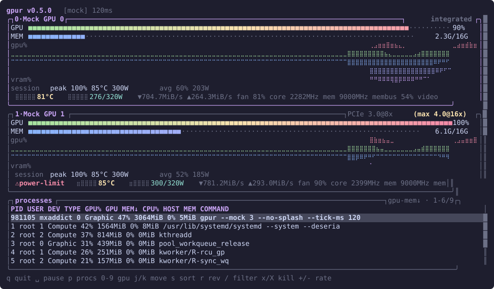

# gpur

btop-style GPU monitor for the terminal. An `nvtop` replacement that runs
everywhere: NVIDIA, AMD, Intel, and Apple GPUs on Linux, macOS, and Windows.

Mirrored braille waveforms, gradient meters, an nvtop-style process table with
per-process GPU attribution, mouse support, foldable GPU cards, and theming via
the hjkl stack.



> **Status: beta.** The AMD Linux path is the one exercised on real hardware.
> The NVIDIA, Intel, macOS, and Windows backends are implemented, and their pure
> parsing layers have unit tests over recorded fixtures (PDH instance names in
> `windows.rs`; fdinfo and sysfs trees in `linux.rs`, `amd.rs`, `intel.rs`), but
> no CI runner has a usable GPU: the CI backend probe accepts the "no supported
> GPU backend" exit as success, so it proves the graceful no-hardware path and
> nothing about live data. The PTY integration tests are Unix-only; Windows runs
> the unit and smoke suites. Real-GPU reports are very welcome.

## Install

```sh
cargo install gpur              # crates.io
yay -S gpur-bin                 # Arch (AUR)
brew install kryptic-sh/tap/gpur  # macOS
scoop install kryptic/gpur      # Windows
```

Debian/RPM packages, musl builds, and an Alpine `.apk` are attached to each
[GitHub release](https://github.com/kryptic-sh/gpur/releases).

## Run

```sh
gpur                  # real GPUs
gpur --mock           # fake GPUs, works anywhere
gpur --mock 6         # demo a 6-GPU rig (1-16; out of range is an error)
gpur --once           # one text snapshot, no TUI (scripts, quick checks)
gpur --json           # machine-readable snapshot (waybar/polybar, monitoring)
gpur --log x.jsonl    # append one JSON record per poll (benchmark/sensor logs)
gpur --replay x.jsonl # re-drive the TUI from a --log recording
gpur --graphs ascii   # graph glyphs: braille (default) | block | ascii
gpur --tick-ms 250    # poll interval in ms, floor 50 (overrides the config)
gpur -c my.toml       # --config: alternate config.toml
gpur -t my-theme.toml # --theme: theme file (overrides the config)
gpur --no-splash      # skip the startup splash
```

`--replay` and `--mock` are mutually exclusive. The TUI needs a terminal: with
stdout redirected it exits with
`stdout is not a terminal — use --once or --json for non-interactive output`
rather than a panic.

## Keys & mouse

| Input                  | Action                                                      |
| ---------------------- | ----------------------------------------------------------- |
| `q` / `Esc` / `Ctrl-C` | quit (`Ctrl-C` works in the filter input too)               |
| `?`                    | help overlay (any key closes it)                            |
| `Space`                | pause/resume polling                                        |
| `0`-`9`                | focus GPU list + select GPU N; same digit again folds it    |
| `p`                    | focus process list                                          |
| `j`/`k`, arrows        | move within the focused pane                                |
| `J`/`K`, PgUp/PgDn     | move the process cursor from anywhere                       |
| `s` / `r`              | cycle process sort column / reverse it                      |
| `/`                    | filter processes (Enter applies, empty clears, Esc cancels) |
| `x` / `X`              | SIGTERM / SIGKILL the selected process (`y` confirms)       |
| `+`/`=` / `-`          | poll rate faster/slower (floor 50 ms)                       |
| wheel / click          | scroll + focus the pane under the cursor; click selects     |

The filter input also takes `Ctrl-U` (clear) and `Ctrl-W` (delete word).

**Killing processes is deliberately restricted.** `x`/`X` only open the confirm
dialog when the process pane has focus (press `p` first) — otherwise the status
line says so, because the process cursor is not visible from the GPU pane. gpur
refuses to signal pid 1, its own pid, and any process with no readable
executable (kernel threads), and refuses outright under `--mock` and `--replay`,
whose pids describe fabricated or foreign processes. The pending kill pins the
target's start time, so a pid recycled between the prompt and `y` is rejected
instead of signalled.

## Configuration

`gpur` reads `$XDG_CONFIG_HOME/gpur/config.toml` (falls back to
`~/.config/gpur/config.toml`). No file is written automatically; missing file
means built-in defaults.

```toml
# poll interval in milliseconds; floor 50
tick_ms = 1000
# MINIMUM history samples kept per GPU. Wide terminals keep more: braille
# graphs consume two samples per column, so retention grows with the widest
# graph drawn and this value is only the lower bound.
history_len = 300
# graph glyphs: "braille" (default), "block", or "ascii" for fonts
# without braille coverage
graphs = "braille"
# hjkl-theme TOML; omit for the built-in theme
theme = "/path/to/theme.toml"
```

### Persisted UI state

On a clean quit gpur writes `state.json` into its cache directory
(`$XDG_CACHE_HOME/gpur/state.json` on Linux, the platform cache dir elsewhere).
It holds folded cards, the process sort column and direction, and the poll rate
— it is not a config file and is safe to delete.

Folds are recorded per device (`folded_devices`), keyed by the identity the
backend reports — NVML UUID, PCI address, IOKit registry entry id, adapter LUID
— so adding or removing a card between runs folds the same GPU you folded, not
whatever now sits in its slot. A `state.json` written before that key existed
holds bare positions instead; those cannot be mapped onto the current devices,
so they are dropped (the rest of the file is still honoured) and folds are set
again on the first run after the upgrade.

The poll rate resolves as `--tick-ms` > persisted rate > `config.toml`, and the
persisted rate counts only when you chose it interactively with `+`/`-` (tracked
by `tick_ms_explicit` in the file). A rate that merely came from `config.toml`
or a one-off `--tick-ms` is never made sticky, so editing `tick_ms` in the
config always takes effect. A `state.json` written before that flag existed is
honoured once, then rewritten with real provenance on the next clean quit.

`--once` and `--json` ignore `state.json` entirely, so headless output never
depends on what someone once pressed in the TUI.

Themes use the [hjkl-theme](https://crates.io/crates/hjkl-theme) schema:
`[palette]` of hex colors plus `[ui]` styles. Any hjkl theme file works — the
meters, waveform gradients, and highlights all derive from the palette.

## Backends

| Backend | Platform       | Source                             | Status |
| ------- | -------------- | ---------------------------------- | ------ |
| nvml    | Linux, Windows | NVML (dynamic load)                | done   |
| amdgpu  | Linux          | sysfs `/sys/class/drm` + fdinfo    | done   |
| intel   | Linux          | i915/xe fdinfo + hwmon + PCI sysfs | beta   |
| pdh     | Windows        | GPU Engine/Adapter Memory + DXGI   | beta   |
| ioaccel | macOS          | IOAccelerator PerfStats (IOKit)    | beta   |
| mock    | all            | deterministic waves (`--mock`)     | done   |

_done_ = feature-complete against what the source exposes and exercised on real
hardware or fully deterministic. _beta_ = implemented with fixture-tested
parsers, but not yet confirmed against a real GPU — see Status above.

Probe order: nvml → amdgpu → intel → ioaccel, then pdh. **Every vendor backend
that finds devices is used**, not just the first: a mixed-vendor machine — an
NVIDIA dGPU beside an AMD APU, an Intel iGPU beside an AMD dGPU — lists all of
its GPUs in probe order, in one card list and one process table. The vendor
backends are disjoint (each claims only its own PCI vendor's devices), so
nothing is counted twice.

When two or more probe, the header reads `[multi]` and the driver line names
each one (`nvml driver 550.1 · amdgpu · kernel 7.1`); a single-vendor machine is
unchanged and still reports that backend by name. Device indices are pinned for
the session: if one vendor's driver goes away mid-run its cards stay in place as
`… (unavailable)` rather than sliding the other vendor's GPUs onto their graphs,
and the process table's `DEV` column keeps pointing at the right card. Killing a
process stays disabled unless every active backend reports pids that belong to
this machine.

pdh is the one backend that is not vendor-specific: DXGI enumerates every
adapter regardless of vendor, so it would report an NVIDIA card nvml already
covers in far more detail. It runs as a peer anyway, filtered — it is told which
PCI vendors the vendor backends claimed and drops those adapters at probe time,
so an NVIDIA + Intel Windows laptop lists the dGPU from nvml and the iGPU from
pdh, each exactly once. When every adapter it can see is already claimed (an
NVIDIA-only Windows box) it reports nothing and nvml stays the sole backend.

The match is by PCI vendor, not per device: DXGI hands out an adapter LUID and
NVML a UUID or PCI BDF, and neither maps to the other. The cost of the coarser
match is that an adapter DXGI enumerates but its own vendor's backend does not
report is hidden rather than shown twice — the same blind spot pdh had before,
now narrowed to one vendor.

Intel utilization is derived from per-client fdinfo engine counters (i915
busy-ns, xe cycles) the same way nvtop does it; power comes from the hwmon
energy counter delta; VRAM total comes from `physical_vram_size_bytes` per tile
on xe (summed) or `lmem_total_bytes` on i915 where the driver publishes it, and
is reported as unknown rather than zero when neither answers. An Intel iGPU has
no local memory region at all, so its system-RAM graphics pool is reported in
the same GTT fields as an AMD APU's.

PDH is the vendor-generic Windows backend (Task Manager's counters) and reports
utilization, memory, and split encode/decode for every adapter no vendor backend
already claimed.

Backend poll failures degrade gracefully: the last snapshot stays on screen with
a header warning until polling recovers — a driver reset won't kill the monitor.

Extras: each GPU card shows session peaks/averages (util, temp, power) when tall
enough, and the PCIe caption flags a link running below its maximum
(`PCIe 3.0@8x (max 4.0@16x)`) — a classic symptom of a bad riser or wrong slot.

Encoder/decoder activity shows in each card: split `enc`/`dec` on NVIDIA and
Windows, unified `video` on Intel, and on AMD the unified figure plus the
`enc`/`dec` split where amdgpu names those rings separately. A red throttle
badge appears when the GPU is thermal- or power-limited (real reasons on NVIDIA,
at-limit heuristic on AMD).

Planned depth: Apple temperature/power (SMC/IOReport), Windows AMD ADLX
(temps/fans/clocks).

## Current limitations

- **Windows vendor exclusion is per vendor, not per adapter.** pdh drops every
  adapter whose PCI vendor a vendor backend claimed, because DXGI's LUID and
  NVML's UUID/BDF do not map to each other. So a card DXGI enumerates that its
  own vendor's backend does not report — an NVIDIA card nvml refuses while nvml
  itself still initializes — is hidden rather than listed twice.
- **Digit keys cover GPUs 0-9 only.** `--mock` accepts up to 16 and real rigs
  can exceed ten devices; GPUs 10 and above are reachable with `j`/`k` and the
  wheel, but cannot be selected by digit or folded.
- **No per-process attribution on macOS** — there is no public API for it.
- **PCIe throughput (`▼`/`▲`) comes from NVML on NVIDIA and is ASIC-gated on
  AMD**: amdgpu's `pcie_bw` exists only where the ASIC implements
  `get_pcie_usage` (Vega10/20, Navi 1x/2x), and is absent on APUs and RDNA3.
  Intel and PDH report none.

## Per-process GPU attribution

The process table (PID, user, device, type, GPU%, GPU memory, CPU%, host memory,
command) works on Linux (AMD + Intel via `/proc` fdinfo — same-user processes
unless run as root), NVIDIA everywhere (NVML), and Windows (PDH per-pid
counters). macOS has no public per-process GPU API. On Linux, containerized
processes get a CONTAINER column (docker/podman/k8s id from cgroups).

Recorded sessions replay: `gpur --log run.jsonl` while it happens, then
`gpur --replay run.jsonl` anywhere — including machines with no GPU — with the
recorded process attribution intact (user, command, CPU%, host memory and
container come from the recording, never re-resolved against the replaying
host's `/proc`). Ideal for bug reports. Replayed pids are never signalable.

### Record shape

`--log` lines and `--json` snapshots are the same JSON object, so a recording
can be diffed against a snapshot:

```json
{ "ts_ms": 0, "backend": "amdgpu", "driver": "…", "gpus": [], "processes": [] }
```

`backend` and `driver` are what a maintainer needs first in a bug report.
`processes` is the **unfiltered** table in a fixed order (GPU memory descending,
then pid, then GPU index, with figures the backend could not read sorted last),
so a UI filter can never silently drop rows from a recording and script output
does not depend on the persisted sort. `--once` combined with `--log` writes
exactly one record.

**Any metric can be `null`**, at both levels: a reading the backend could not
take is absent rather than zero, because `0%` and `0MiB` are claims about an
idle GPU and an empty pool. Per process that covers `gpu_util_pct`,
`gpu_mem_bytes`, `cpu_pct` and `host_mem_bytes` — NVML reports no per-process
memory at all under WDDM, the usual Windows configuration, so those rows are
`null` there rather than a fabricated `0`. Consumers should treat `null` as "not
measured", not as zero. Recordings made before 0.11 carry `0` in those fields
and still replay; the reverse is not true, so a log written by 0.11 or later
cannot be read by an older gpur.

## License

MIT
